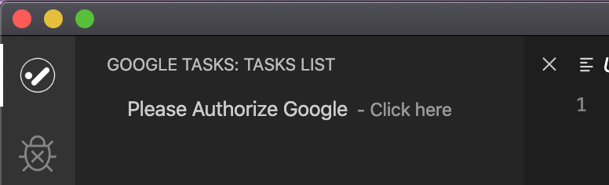
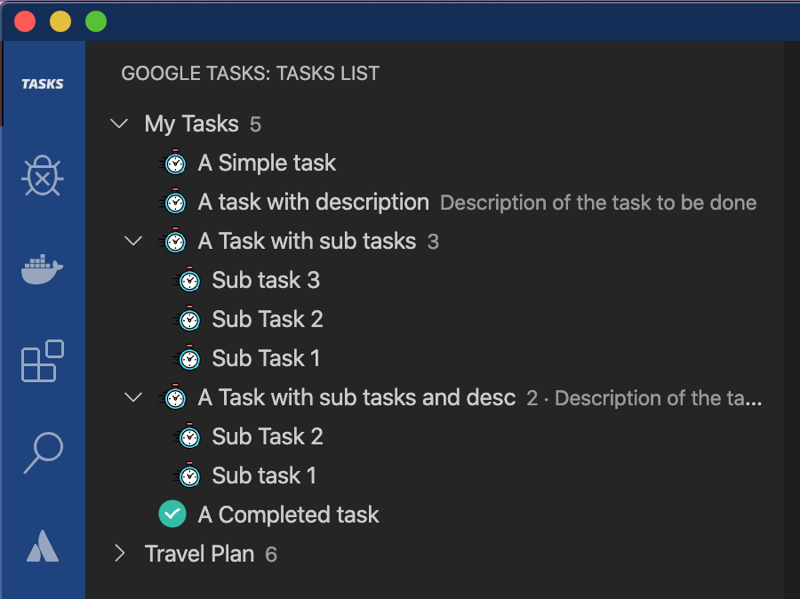

# Google Tasks for VSCode (unofficial)

Manage your To-Do list without going out of VSCode Editor.

> This is not an official product of Google

This application is an extension to [VS Code Editor](https://code.visualstudio.com/) for viewing the list of tasks from [Google Tasks](https://support.google.com/tasks/answer/7675772) application in the tree view of VSCode.

# Find this app in:

- VSCode Marketplace: https://marketplace.visualstudio.com/items?itemName=KrishnaPravin.google-tasks
- GitHub: https://github.com/KrishnaPravin/google-tasks-vscode-extension

## Screenshots

Authorize with Google after installing the extension

A tree view with the list of tasks from your google Tasks application will be available

## Privacy Policy

This extension accesses the user data only during the runtime of VSCode application. User data means only the data that is created by the user within the Google Tasks application. The accessed user data is directly displayed within the VSCode Editor. Also, this data is not persisted in any medium and is not sent or shared to any server or any 3rd party application

## Known Issues

- Not able to logout 🚪🏃

## Release Notes

### 0.1.0

🤞Initial release of google-tasks extension with read only list of Google Tasks

**Enjoy!**
